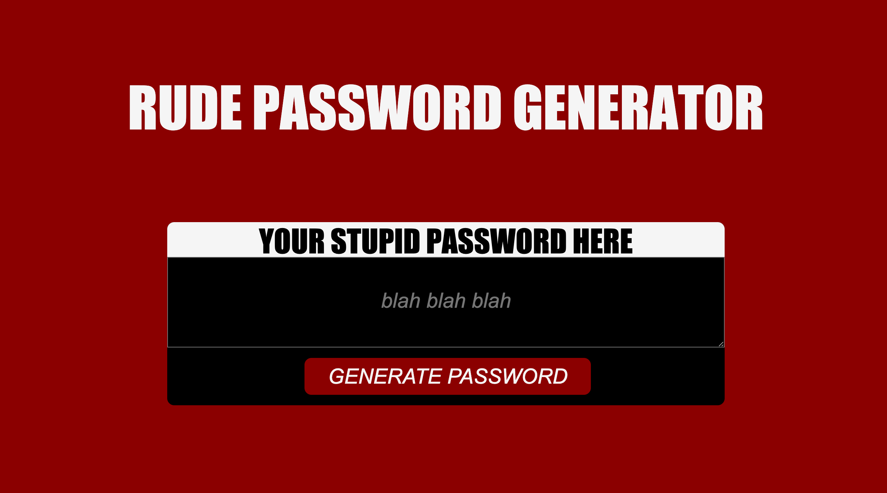

# <RudePasswordGenerator>

## RUDE PASSWORD GENERATOR

## DESCRIPTION
I was asked to produce an application that generates passwords according to specifications set by the user. To accomplish this task, I used Javascript to create a series of prompts that allow the user to select their desired password length, and choose if they would like uppercase letters, lowercase letters, numbers, and special characters in their password. Then, I created a series of functions that applied the user's selections to the final password. 

To make my application a little bit more fun, I gave my password generator a rude personality by adding snarky comments into the prompts. 

This was my first big project using Javascript, and it proved to be really challenging, but so rewarding in the end! It really helped me build confidence in using strings, arrays, and functions – and taught me about new features like 'window.prompt'.

## INSTALLATION 
To view finished webpage, go to https://alyscorpio.github.io/RudePasswordGenerator/.
To view repository on Github, go to https://github.com/alyscorpio/RudePasswordGenerator.

Here is a screenshot of the application:

## USAGE
To use the password generator, load the page and click on the 'generate password' button at the bottom of the card. You will then recieve a series of prompts asking how long you would like your password to be, and what kinds of characters you would like it to have. Once the final prompt is submitted, your new password will appear in the center of the card.

## Credits
Application created under the direction of UCLA Extension Coding Bootcamp.
Javascript help from https://www.w3schools.com/java/default.asp.

## License
MIT License

Copyright (c) [2021] [AlyssaDickerson]

Permission is hereby granted, free of charge, to any person obtaining a copy of this software and associated documentation files (the "Software"), to deal in the Software without restriction, including without limitation the rights to use, copy, modify, merge, publish, distribute, sublicense, and/or sell copies of the Software, and to permit persons to whom the Software is
furnished to do so, subject to the following conditions:

The above copyright notice and this permission notice shall be included in all copies or substantial portions of the Software.

THE SOFTWARE IS PROVIDED "AS IS", WITHOUT WARRANTY OF ANY KIND, EXPRESS OR IMPLIED, INCLUDING BUT NOT LIMITED TO THE WARRANTIES OF MERCHANTABILITY, FITNESS FOR A PARTICULAR PURPOSE AND NONINFRINGEMENT. IN NO EVENT SHALL THE AUTHORS OR COPYRIGHT HOLDERS BE LIABLE FOR ANY CLAIM, DAMAGES OR OTHER LIABILITY, WHETHER IN AN ACTION OF CONTRACT, TORT OR OTHERWISE, ARISING FROM, OUT OF OR IN CONNECTION WITH THE SOFTWARE OR THE USE OR OTHER DEALINGS IN THE
SOFTWARE.

## Badges
https://img.shields.io/badge/RudePasswordGenerator-PassGen__Homework__2021-green

## Features
<link rel="html" href=".index.html">
<link src="./assets/java/script.js">
<link rel="stylesheet' href='./assets/css/style.css">